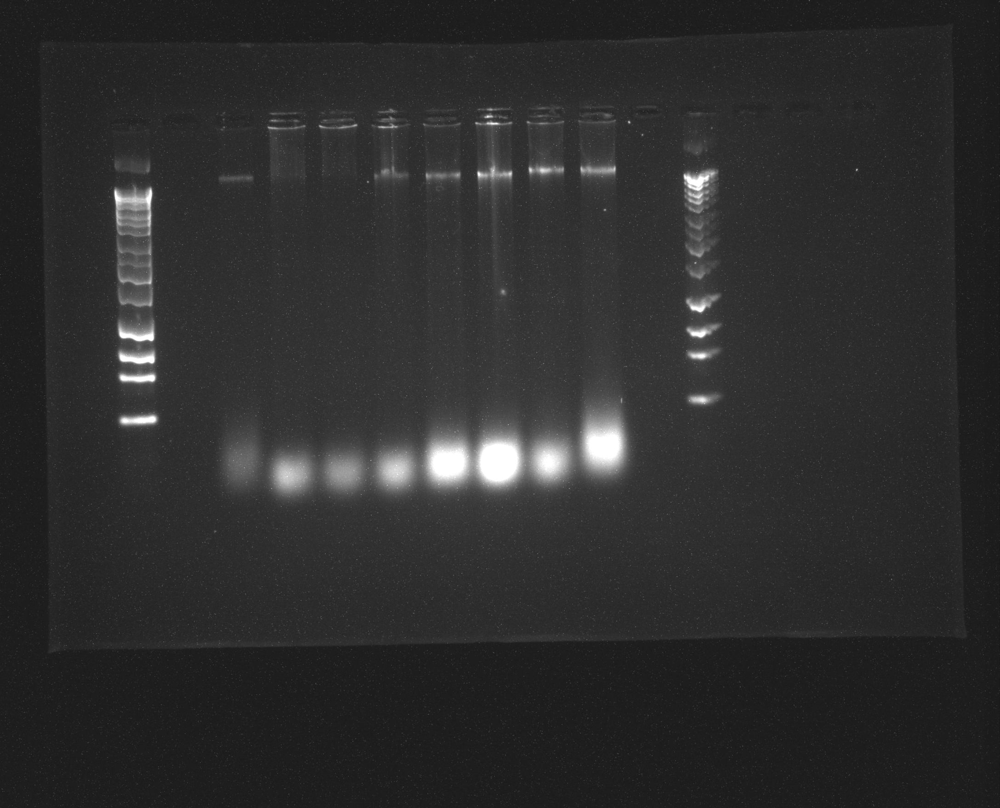
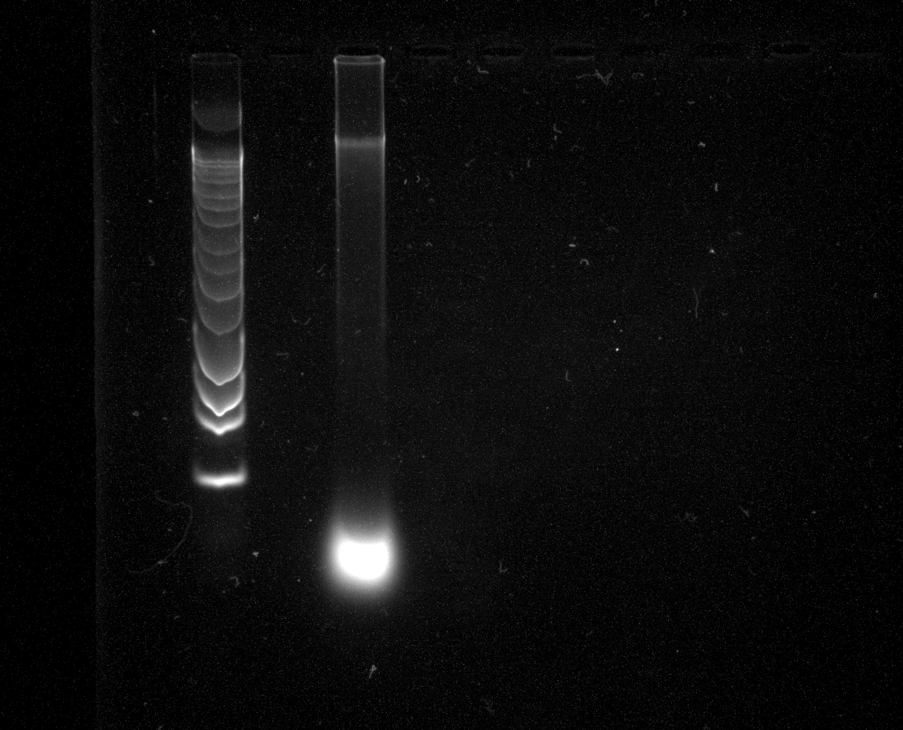

**Overview**

+ Cleanup DNA using AMPure
+ Quant and gel pic

**Detailed procedure**

**Did you do the nanodrop for these samples? Can you put the values in the table below?**

Date:

|ID|ng/μL|260/280|260/230|
|:-----:|:-----:|:-----:|:-----:|
|C3D_1|266.9|1.95|2.11|
|C3D_2|378|1.97|1.55|
|C3D_3|174.1|2.17|1.47|
|C3D_4|240.8|2.19|0.83|
|C3D_5|497.6|1.9|2.11|
|C3D_6_C|350.7|2.04|2.19|
|C3D_7|413|1.94|1.91|
|C3D_8|554.4|1.86|1.97|

1. All C3D samples were qubit'd using the HS DNA detection kit. 

Date:

|ID|ng/μL|total_ng|
|:-----:|:-----:|:-----:|
|C3D_1|31.8|954|
|C3D_2|36.2|1086|
|C3D_3|22.8|684|
|C3D_4|49.6|1490.7|
|C3D_5|53.2|1596|
|C3D_6|72.4|2172|
|C3D_7|45.6|1368|
|C3D_8|67.2|2016|

2. DNA chosen was C3D6, as it looked like it contained a reasonable amount of high molecular weight DNA and had a high concentration as per Qubit.

3. AMPure clean-up using protocol PN 100-801-600 "Purify DNA", using 0.6X beads at recommendation of Vickie. Sample was brought up to 50uL at beginning of prep **--Did you use all of this sample? What was the volume?--**, and 30uL beads were added. 

4. Qubit HS took place after clean-up, with DNA in a 40uL elution - named C3D6c. 

|ID|ng/μL|total_ng|%_loss|
|:-----:|:-----:|:-----:|:-----:|
|C3D_6C|36.4|1456|32.97%|

5. 0.8% gel, 60V for 2 hours ran to assess if low molecular weight DNA had been cleared. 

